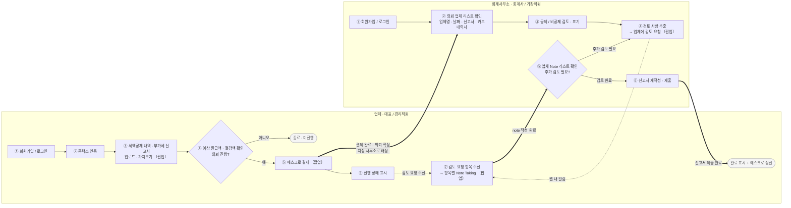

# 서비스 다이어그램 (User Flow) — RTBK

> 기반: `inputs/service_flow.mermaid`(사용자 도식) + `inputs/guide.md` + `inputs/notes.md`.
> 맥락: GNB **`부가가치세`** 탭 하위, **업체 측 / 회계사무소 측** 두 역할 탭. (GNB = 부가가치세 1 + 빈 슬롯 5)
> 플랫폼: **웹 전용**. 알림: **웹 내 알림 기능**.

## 플로우: 부가가치세 신고·환급 의뢰 (업체 ↔ 회계사무소)

- **시작점**: 업체/회계사무소 각각 회원가입·로그인
- **종료점(성공)**: 회계사무소 신고서 제출 완료 → 완료 표시 + 에스크로 정산
- **종료점(미진행)**: 업체 ④에서 예상액 확인 후 의뢰 미진행

## 단계 설명

### 업체 측 (COMPANY)

| # | 단계 | 주체 | 화면 유형 | 비고 |
|---|------|------|-----------|------|
| C1 | 회원가입 / 로그인 | 사용자 | 진입 | |
| C2 | 홈택스 연동 | 사용자→시스템 | 탭 화면 | 홈택스 계정 연동 |
| C3 | 세액공제 내역·부가세 신고서 업로드/가져오기 | 시스템 | **팝업** | 연동 데이터 불러오기 + 파일 업로드 |
| C4 | 예상 환급액·절감액 확인 → 의뢰 진행 결정 | 시스템 제시 / 사용자 결정 | 탭 화면 | **분기: 진행 / 미진행** |
| C5 | 에스크로 결제 | 사용자 | **팝업** | 진행 선택 시 |
| C6 | 진행 상태 표시 | 시스템 | 탭 화면 | "진행중" 등 |
| C7 | 검토 요청 수신 → 항목별 Note Taking | 사용자 | **팝업** | 웹 내 알림으로 진입(A4에서) |

### 회계사무소 측 (ACC)

| # | 단계 | 주체 | 화면 유형 | 비고 |
|---|------|------|-----------|------|
| A1 | 회원가입 / 로그인 | 사용자 | 진입 | |
| A2 | 의뢰 업체 리스트 확인 | 시스템 | 탭 화면 | 지정 사무소에 배정된 의뢰만 노출 |
| A3 | 공제 / 비공제 검토·표기 | 사용자 | 탭 화면 | 토글 방식 |
| A4 | 검토 사항 추출 → 업체에 검토 요청 | 사용자→시스템 | **팝업** | 업체 C7로 웹 내 알림 |
| A5 | 업체 Note 리스트 확인 → 추가 검토 판단 | 사용자 | 탭 화면 | **완료까지 A4로 반복** |
| A6 | 신고서 재작성·제출 | 사용자 | 탭 화면 | 제출 완료 시 에스크로 정산 |

### 핸드오프 / 규칙 (확정)

- **매칭**: `C5 ⇒ A2` — 결제·의뢰 확정 시 **지정한 회계사무소로 배정** (공개 풀 아님).
- **검토 요청**: `A4 ⇢ C7` — **웹 내 알림**.
- **note 왕복(반복)**: `C7 ⇒ A5` → A5에서 추가 검토 필요하면 **`A5 → A4` 로 되돌아가 완료될 때까지 반복**, 완료 시 A6.
- **에스크로 정산**: 업체 C5에서 결제를 걸어두고 실제 정산은 A6 제출 완료 시점.
- **플랫폼**: 웹 전용. **알림**: 웹 내 알림 기능.
